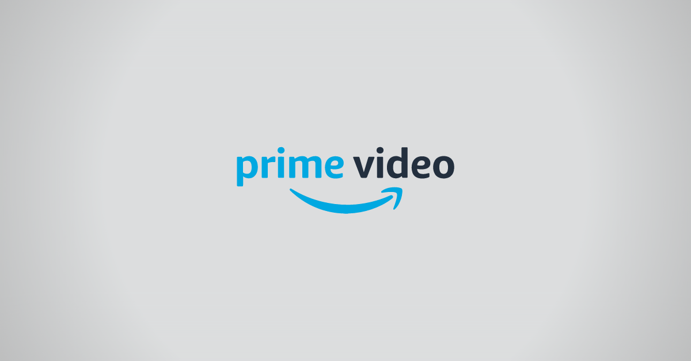
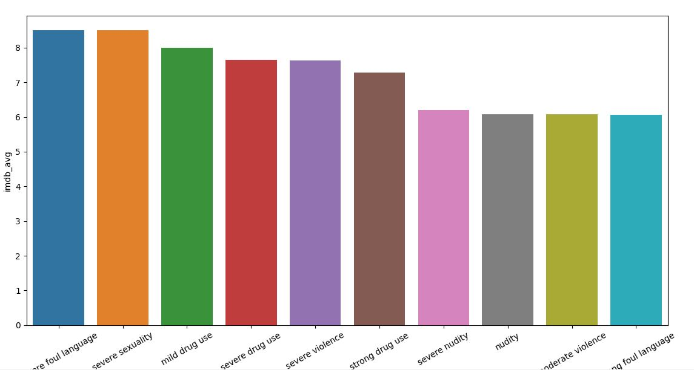
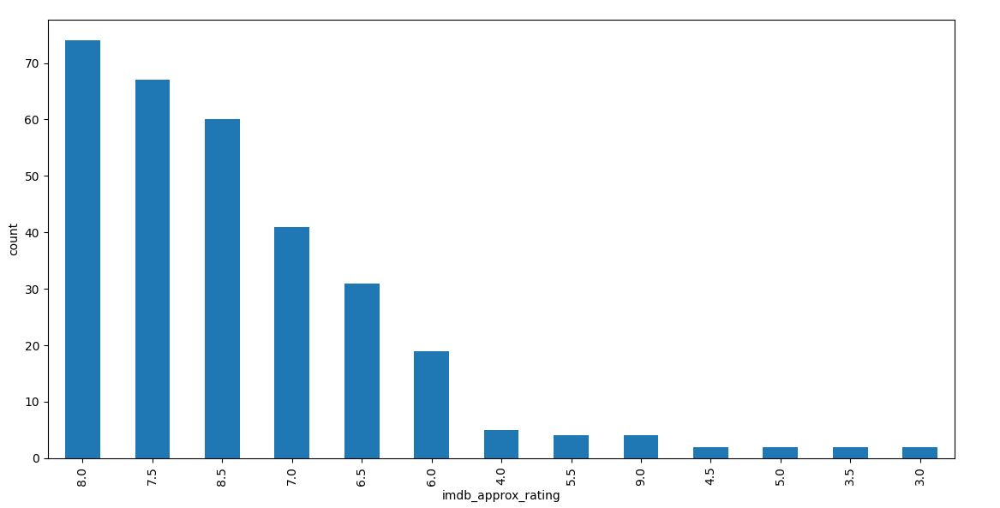
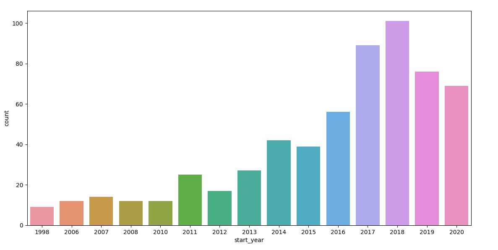
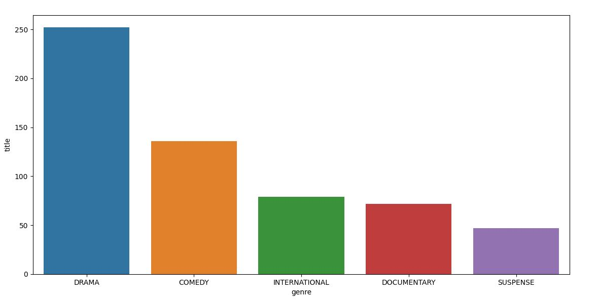
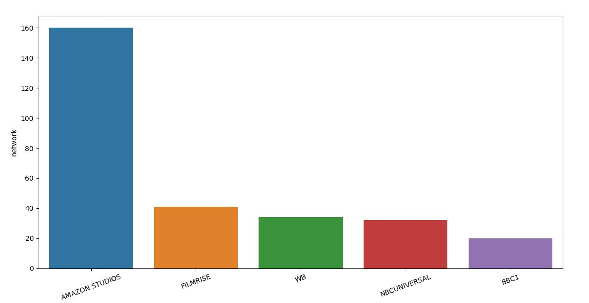
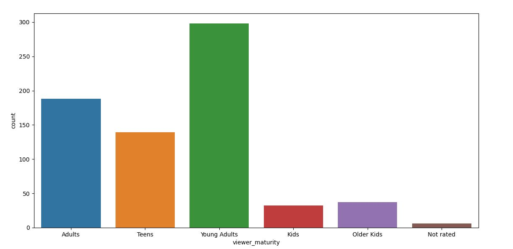
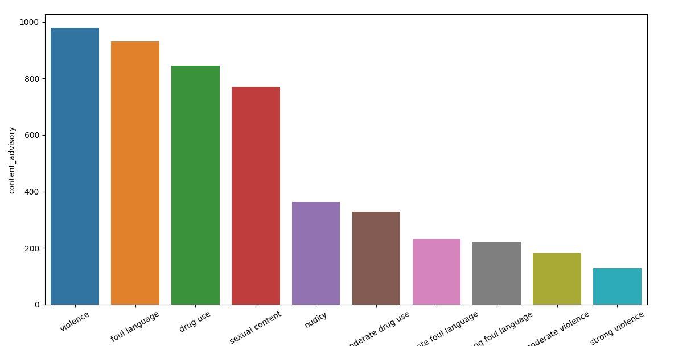

# Scraping Top TV Shows Data from Amazon Prime Video

## Overview

Web scraping is the process of extracting data from websites using its HTML structure. 
In this repo you will find the code I used to scrape data from **Amazon Prime Video** using:

* Python
* Google Chrome Driver
* Selenium
* Beautiful Soup 
* Requests

You will also find some python code to perform basic analysis on the data obtained from the above steps.

## Requirements
* Python 3.6+
* Works on Linux, Windows

## Install
    pip install -r requirements.txt

## Analysis

## Content Advisory Top 10

## IMDb Avg Rating

## Shows vs Year

## Top 5 Genre

## Top 5 Network

## Viewer Maturity

## Content Advisory IMDb Top 10

Thank you for visiting my GitHub profile.